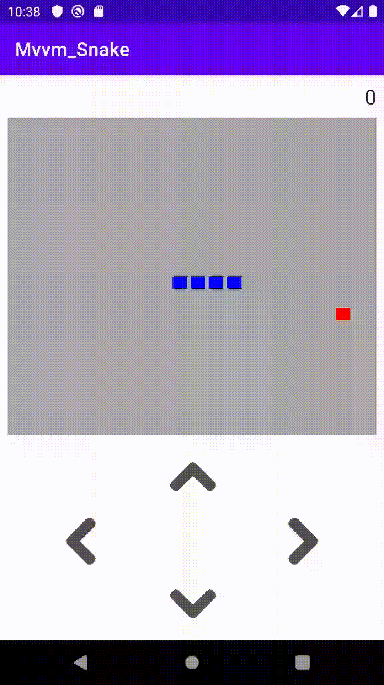
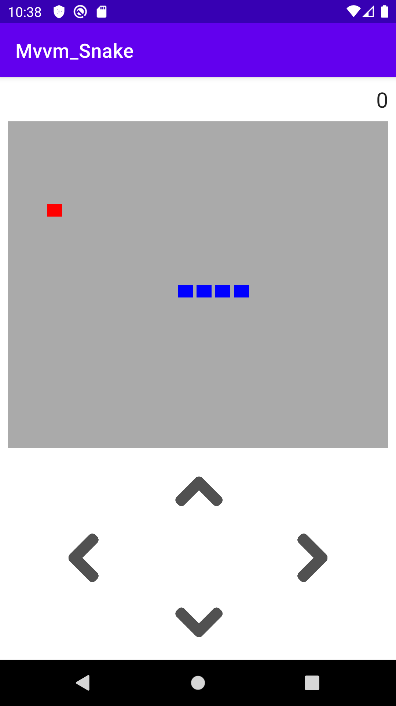
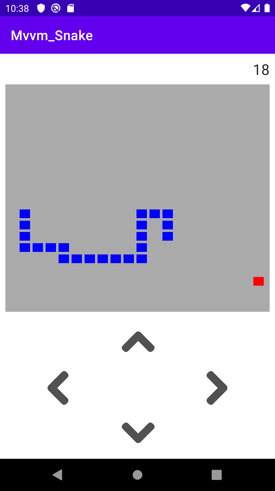

# Practices_Android_HankTom_MvvmSnake
Practices：MvvmSnake

***
#### 項目 ####
HankTom MvvmSnake
---

#### 簡介 ####

本專案為「Android MVVM」的練習專案，由「[綠豆湯學院](https://litotom.com/)」的「HankTom」分享於「Youtube」平台。

- [Kotlin 寫一個貪食蛇 APP 小遊戲? MVVM + 最新 Android Studio 4.1 - 用程式設計改變人生!](https://www.youtube.com/watch?v=LMpJ35tndUw&fbclid=IwAR2EhUtZ_Gw5Zo56utluAGcTh1g0I4xD-Eu8T2voIuvMEBUg0QsWl9caoqo)

<br>

```
Practiecs! Without unceasing practice nothing can be done.
```

<br>

#### 預覽圖 ####





