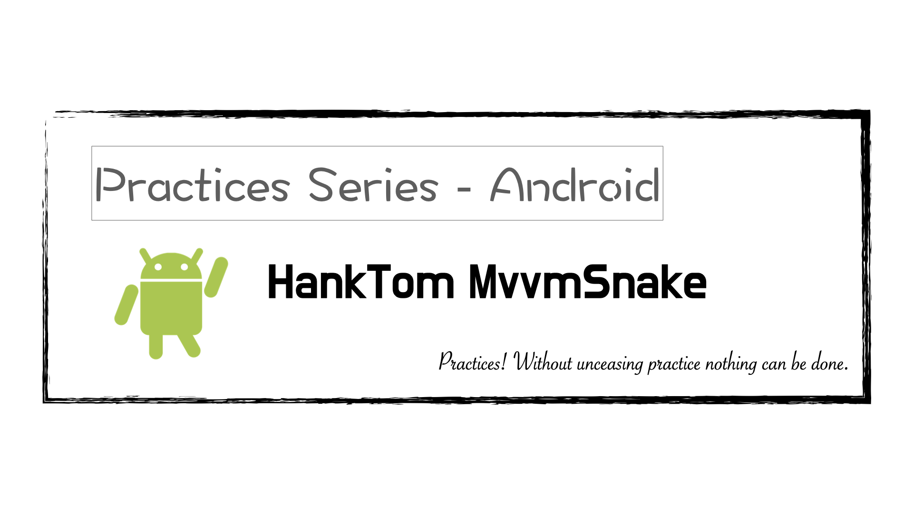

# HankTom MvvmSnake
Practices-Android-HankTom-MvvmSnake

---

---

### 說明 ###

本專案的學習目標是以「MVVM」架構來撰寫「Android」的應用程式；由「[綠豆湯學院](https://litotom.com/)」的「HankTom」分享於「Youtube」平台。

###### 參考連結： ######

- [Kotlin 寫一個貪食蛇 APP 小遊戲? MVVM + 最新 Android Studio 4.1 - 用程式設計改變人生!](https://www.youtube.com/watch?v=LMpJ35tndUw&fbclid=IwAR2EhUtZ_Gw5Zo56utluAGcTh1g0I4xD-Eu8T2voIuvMEBUg0QsWl9caoqo)

---

### 預覽圖 ###

|       動態預覽圖        |      開始遊戲       |        遊戲中         |      遊戲結束      |
|:-----------------------:|:-------------------:|:---------------------:|:------------------:|
|  |  |  |  |

---

###### tags: `Megabank RHCE Training`
